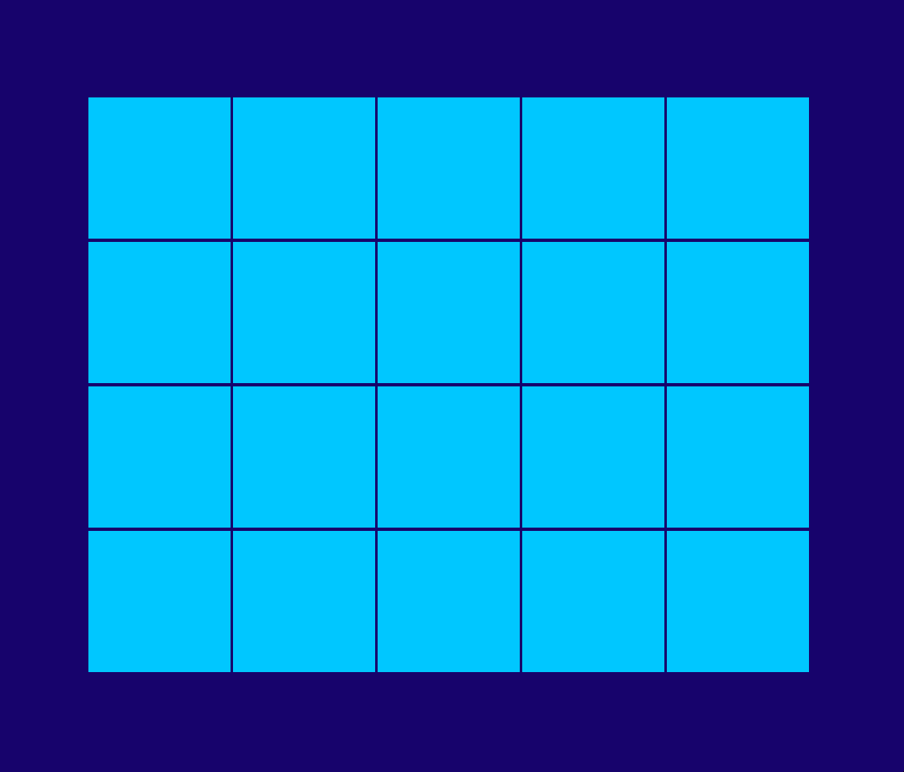

# jogo-da-memoria
 jogo da memória com vanilla js

O tradicional jogo da memória: você escolhe uma imagem e tenta achar o par. Quando o par é encontrado ele some e você segue até achar todos os pares e não sobrar mais nenhuma carta. 

[link para jogar =)](
 https://paulahemsi.github.io/jogo-da-memoria/)

*Imagens usadas no jogo são do espetáculo Há Dias Que Não Morro das ultraVioleta_s feitas pelo coletivo Bijari.*
